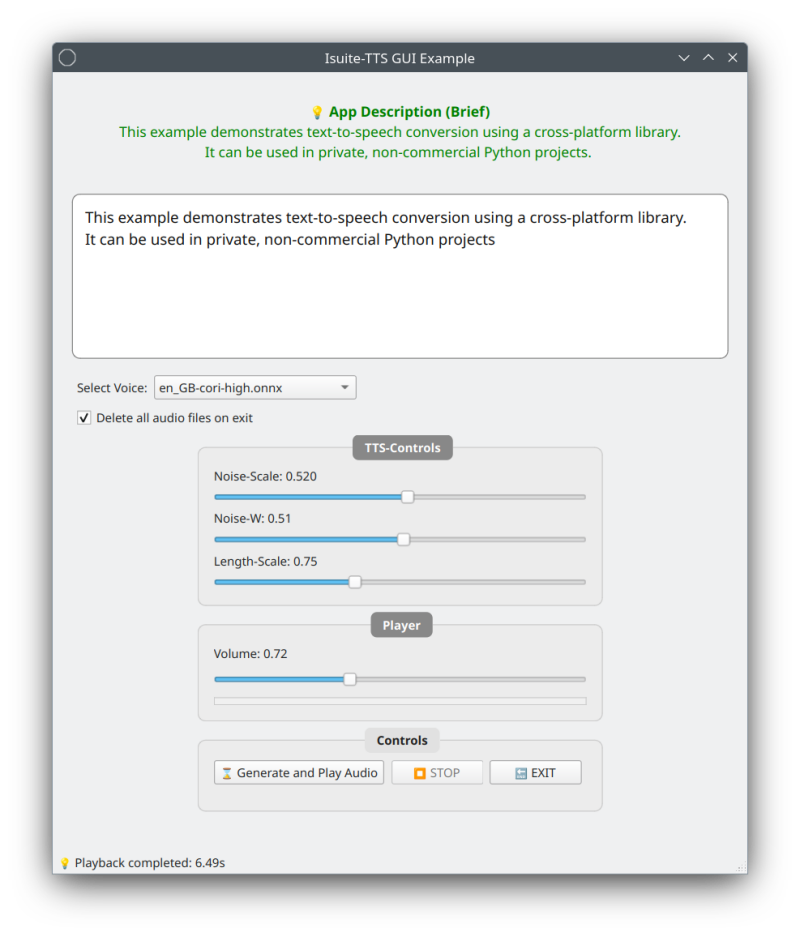

# Isuite-TTS: Text-to-Speech Library



**Isuite-TTS** is a modular, open-source text-to-speech (TTS) library that converts text into high-quality audio output. Powered by the **Piper** library, it supports multiple languages and is compatible with **Linux**, **macOS**, and **Windows**. The library is optimized for both **CLI** and **GUI** interfaces, offering configurable audio parameters for developers.

> **Note**: Isuite-TTS is licensed for **non-commercial use** under the MIT License by default. For commercial use, refer to the [Isuite-TTS Non-Commercial License](LICENSE.md)

> **Audio Example**: Hear Isuite-TTS in action! Listen to a sample of the README converted to audio:

<p style="text-align: center;">🔊 <a href="res/readme_audio.wav">Listen to Isuite-TTS README Audio</a></p>

## 1. Features ✅

- Multi-language support with locally stored models
- Configurable audio parameters (sample rate, volume, pitch)
- CLI and GUI compatibility
- Cross-platform support (Linux: Ubuntu/Debian & CentOS/RHEL, macOS, Windows: 10 & 11)
- Easy installation with platform-specific scripts

## 2. Requirements
- **Python**: Supported versions: 3.12.0 - 3.12.9 ✅ (Magic Number: 0x6d0d0d0a)
> **Python 3.13 is not supported ❌ due to lack of compatible wheels for critical dependencies.**
> Please download and install Python 3.12.x Version from:
<p style="text-align: center;">Link: <a href="https://www.python.org/downloads/">https//www.python.org/downloads</a></p>

- PySide6 (>=6.0.0)
- Piper-TTS
- ONNX (>=1.16.0)
- Pygame
- eSpeak

## 3. Installation
- **Linux**: Run `./installer_linux.sh`
- **macOS**: Run `./installer_macos.sh`
- **Windows**: Run `installer_windows.bat`


### Prerequisites

Install the following system packages to avoid runtime errors:

> | Platform    | Required Packages/Commands                                                                                            |
> | ----------- | --------------------------------------------------------------------------------------------------------------------- |
> | **Linux**   | `sudo apt install portaudio19-dev espeak-ng-data`                                                                     |
> | **macOS**   | `brew install portaudio espeak`                                                                                       |
> | **Windows** | Microsoft Visual C++ Redistributable (x64) from:                                                                      |
> |             | Install Link: <a href="https://aka.ms/vs/17/release/vc_redist.x64.exe">Microsoft Visual C++ Redistributable (x64)</a> |

### Linux/macOS Installation

1. Unzip the '**tar.gz**' file
2. Open a terminal and navigate to the program directory (Replace 'Download' name with your own):

   > ```bash
   > cd Downloads/isuite-tts-v0.1.0
   > ```

3. **Option A: Automated Installation** (Recommended for beginners) Run our platform-specific installer script:

   - **For Linux**
   > ```bash
   > chmod +x installer_linux.sh
   > sudo ./installer_linux.sh
   > ```

   - **For macOS**
   > ```bash
   > chmod +x installer_macos.sh
   > ./installer_macos.sh
   > ```

   - **Run examples**:
   > ```bash
   > ./run_linux_example.sh
   > 'or'
   > ./run_macos_example.sh
   > ```

4. **Option B: Manual Installation**

   - Create and activate a virtual environment:
   > ```bash
   > python3.12 -m venv bin/ai_env
   > source bin/ai_env/bin/activate
   > ```

   - Install the package:
   > ```bash
   > pip install .
   > ```

   - (Optional) Delete temporary installation files:
   > ```bash
   > python post_install.py
   > ```

   - **Run examples**:
   > ```bash
   > source bin/ai_env/bin/activate
   >
   > CLI: python bin/cli_example_tts.py
   > 'or'
   > GUI: python bin/gui_example_tts.py
   > ```

### Windows Installation

1. Before running the installer, please install:

   <p style="text-align: center;">Link: <a href="https://aka.ms/vs/17/release/vc_redist.x64.exe">Microsoft Visual C++ Redistributable (x64)</a></p>

2. Unzip the '**zip**' file
3. **Option A: Automated Installation** (Recommended for beginners)

    - 3.1. Double-clicking on the **installer_windows.bat** file runs the Windows installation.
   
    - 3.2. Run examples:
    > ```bash
    > run_windows_example.bat
    > ```

4. **Option B: Manual Installation** Run our Windows installation script in the ‘cmd.exe’ terminal.

   - Open a terminal and navigate to the program directory (Replace 'Download' name with your own):
   > ```bash
   > cd Downloads\isuite-tts-v0.1.0
   > ```

   - Create and activate a virtual environment:
   > ```bash
   > python3.12 -m venv bin\ai_env
   > ```

   - For Windows PowerShell:
   > ```bash
   > bin\ai_env\Scripts\Activate.ps1
   > ```

   - For classic Windows Command Prompt (cmd.exe):
   > ```bash
   > bin\ai_env\Scripts\activate.bat
   > ```

   - Install the package:
   > ```bash
   > pip install .
   > ```

   - (Optional) Delete temporary installation files:
   > ```bash
   > python post_install.py
   > ```

   - **Run examples**:
   > ```bash
   > bin\ai_env\Scripts\activate.bat
   >
   > CLI: python bin\cli_example_tts.py
   > 'or'
   > GUI: python bin\gui_example_tts.py
   > ```

### Optional additional models (ONNX) integration:

<p style="text-align: center;">Link: <a href="https://rhasspy.github.io/piper-samples/">https://rhasspy.github.io/piper-samples/</a></p>

1. Choose a language model <Language> that you like :-)
2. Download the two files: **xxx.onnx** and **xxx.onnx.json**
3. Copy the files into: **isuite_tts/models/**
4. The installed language model can now be used in the GUI "isuite-tts" app :-)

## 4. Usage 🎯

   **Basic Usage for TTS:**

> ```python
> # Import
> from isuite_tts import TextToSpeech
> 
> # Initialize the TTS system
> tts = TextToSpeech()
> 
> # Run
> tts.generate_tts(
>     "tts/models/en_GB-cori-high.onnx",
>     "TTS convert! The result is WAV format."
> ):
> ```

   **Advanced Usage for TTS:**

> ```python
>    # Import
>    from isuite_tts import TextToSpeech
> 
>    # Variables
>    model = "tts/models/en_GB-cori-high.onnx"  # ONNX nomenclature
>    scale = 0.667    # Noise intensity in synthesis (0.0-1.0) default: 0.667
>    w = 0.8          # Deviation from the original: default: 0.8
>    len_scale = 1.0  # Speech rate (0.0-2.0) default: 1.0
>    text = "TTS convert! The result is WAV format."  # String format
>    dir_file = "audio/file.wav"  # File directory, default: 'audio/wav/'
> 
>    # Initialize the TTS system
>    tts = TextToSpeech()
> 
>    # Run
>    tts.generate_tts(model=model, text=text):
> 
>    # or
>    tts.generate_tts(model=model,
>                     text=text,
>                     noise_scale=scale,
>                     noise_w=w,
>                     length_scale=len_scale):
> 
>    # or
>    tts.generate_tts(model=model, text=text, output_file=dir_file):
> ```

   **Usage for Audio Player:**

> ```python
> # Variables
> audio_dir = directory/*.wav # File directory
> volume = 0.95  # Range = (0.0-2.0) default: 1.00
> 
> # Initialize the Audio Player
> player = AudioPlayer()
> 
> # Run
> player.play_audio(audio_dir)
> 
> # or
> player.play_audio(audio_dir, volume)
> 
> # Waiting for playback to finish
> player.wait_for_completion()
> 
> # (Optional) Additional Extended global methods
> player.wait_for_completion()
> player.set_volume(volume: float)
> player.is_playing_status(self):
> player.stop()
> ```

## 5. Configuration ⚙️

Adjust audio settings and model paths in the following files:

- `configs/tts_config.json`: Configure Audio parameters (sample rate, volume, pitch).
- `configs/tts_models_config.json`: Specify paths to Piper TTS models for different languages.

**Example** (`tts_models_config.json`):

> ```json
> {"en": "tts/models/en_GB-cori-high.onnx",
>  "de": "tts/models/de_DE-karlsson-low.onnx"}
> ```

## 6. Troubleshooting ❓

**Common Issues:**

- IMPORTANT: Check "Add Python to PATH" during installation!
  > ```bash
  > python --version 'or' python3 --version
  > pip --version
  > `

- **No audio output**: Ensure espeak is installed and system audio is not muted
- **Emojis not displaying in GUI (Linux)**: Install fonts-noto-color-emoji
  
  > ```bash
  > sudo apt install fonts-noto-color-emoji
  > ```
- **Permission denied errors**: Make sure to run with appropriate permissions or use virtual environments
- **Python module import errors**: Ensure you're in the correct virtual environment

**Debugging Tips:**

1. Check if all dependencies are installed:
   
   > ```bash
   > pip list | grep -i piper
   > ```
2. Verify your Python version:
   
   > ```bash
   > python --version
   > ```

## 7. Performance Tips

- Use smaller models for faster processing (lower quality)
- Larger models provide better voice quality but take more time
- Consider using the streaming mode for long texts

## 8. Contributing

Contributions are welcome! Please:

> 1. Fork the repository
> 2. Create a feature branch
> 3. Commit your changes
> 4. Push to the branch
> 5. Open a Pull Request

## 9. License

- **Non-commercial use**: Licensed under the [Isuite-TTS Non-Commercial License](LICENSE.md)
- **Commercial use**: Contact Andrzej Mazur at: info@isuite.org for licensing details
- **Third-party licenses**: Isuite-TTS uses third-party libraries, including Piper (MIT License). See [Third-Party Licenses](LICENSE.md) for details.

## 10. Resources

- [GitHub Repository](https://github.com/<dein-username>/Isuite-TTS)
- [eSpeak](https://github.com/espeak-ng/espeak-ng) - Text-to-Speech engine
- [ONNX Model Repository](https://onnx.ai/) - ONNX models used in Isuite-TTS
- [Piper TTS](https://github.com/rhasspy/piper) - Piper Text-to-Speech library (MIT License)
- [Pygame](https://www.pygame.org/) - Multimedia library for Python
- [PySide6](https://www.qt.io/qt-for-python) - Python bindings for Qt
